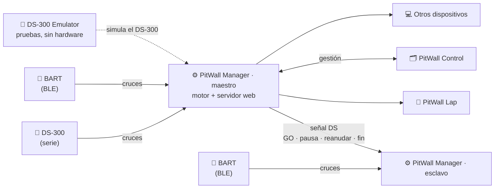

# 🏁 PitWall

**El ecosistema completo para tu slot racing** — cronometra desde el hardware, síguela en directo por voz y gestiona toda la temporada.

🌐 **[pitwall.es](https://pitwall.es)**

🇪🇸 **[Español](#español)**  ·  🇬🇧 **[English](#english)**  ·  🇫🇷 **[Français](#français)**  ·  🇮🇹 **[Italiano](#italiano)**

---

## Español

PitWall no es una app, son varias piezas que trabajan juntas alrededor de una carrera de slot. **Manager** es el motor: habla con el cronómetro físico, cuenta las vueltas y hace de servidor web para el resto. **Lap** y **Control** se conectan a él para vivir la carrera en directo y gestionar la temporada. El **emulador DS-300** nos permite probar todo sin el hardware real.

Un Manager puede funcionar como **maestro** o como **esclavo**. El maestro obtiene sus cruces de un **DS-300** o directamente de un **BART**, y manda la **señal DS** (GO, pausa, reanudar, fin) al esclavo; el esclavo obedece esa señal pero recibe **sus cruces desde un BART**.

### Repositorios

| Pieza | Qué hace | Repo |
|---|---|---|
| ⚙️ **PitWall Manager** | El cerebro. Habla con el cronómetro (DS-300 por serie o BART por Bluetooth LE), cuenta cada cruce, calcula tiempos y estadísticas, y sirve la carrera en directo. | [PitWall-Manager](https://github.com/vgonzalezgomez85/PitWall-Manager) |
| 📱 **PitWall Lap** | Tu copiloto de bolsillo. Mientras corres, te da tiempos, posición y gaps **por voz**, sin apartar la vista del coche. iOS y Android. | [PitWall-Lap](https://github.com/vgonzalezgomez85/PitWall-Lap) |
| 🗂️ **PitWall Control** | La temporada bajo control: clasificaciones por copas y categorías, fichas de pilotos y equipos, calendario, tesorería y créditos. | [PitWall-Control](https://github.com/vgonzalezgomez85/PitWall-Control) |
| 🧪 **DS-300 Emulator** | Emula la centralita DS-300 por puerto serie para probar el sistema sin el hardware físico. | [DS300-Emulator](https://github.com/vgonzalezgomez85/DS300-Emulator) |
| 🌐 **PitWall Web** | El sitio web y los manuales de [pitwall.es](https://pitwall.es). | [PitWallWeb](https://github.com/vgonzalezgomez85/PitWallWeb) |

### Comunidad y contribución

PitWall nace como una **base abierta para que la comunidad aporte su granito de arena**. La idea es simple: sobre lo ya construido, cualquiera puede proponer mejoras, corregir errores o añadir funciones nuevas.

A cambio pedimos una sola cosa: **quien añada una funcionalidad, que la documente**. Queremos que el proyecto esté siempre bien mantenido y bien documentado, para que no haya confusiones ni en el uso ni en el desarrollo. En la práctica:

- **Documenta lo que aportas** — actualiza el README (o los manuales) del repo correspondiente en el mismo cambio que añade la función.
- **Cambios claros** — abre un *issue* para debatir y un *pull request* enfocado, con una descripción de qué hace y por qué.
- **Deja el proyecto mejor que lo encontraste** — sin funciones a medias ni sin explicar.

Toda ayuda es bienvenida: código, documentación, traducciones, pruebas o reportar errores.

### Licencia

Todo el software de PitWall es **software libre** bajo la **GNU Affero General Public License v3 (AGPLv3)** o, a tu elección, cualquier versión posterior. Consulta el archivo [`LICENSE`](./LICENSE) de cada repositorio.

Copyright © 2026 Víctor González Gómez. El nombre «PitWall» y el logotipo no forman parte de la licencia del código.

---

## English

**PitWall — the complete ecosystem for your slot racing:** time the race from the hardware, follow it live by voice, and manage the whole season.

PitWall isn't a single app but several pieces working together around a slot race. **Manager** is the engine: it talks to the physical timer, counts the laps and acts as a web server for the rest. **Lap** and **Control** connect to it to follow the race live and manage the season. The **DS-300 emulator** lets us test everything without the real hardware. *(See the diagram above.)*

### Repositories

| Piece | What it does | Repo |
|---|---|---|
| ⚙️ **PitWall Manager** | The brain. Talks to the timer (DS-300 over serial or BART over Bluetooth LE), counts every crossing, computes times and stats, and serves the race live. | [PitWall-Manager](https://github.com/vgonzalezgomez85/PitWall-Manager) |
| 📱 **PitWall Lap** | Your pocket co-driver. While you race it reads out lap times, position and gaps **by voice**, so you never take your eyes off the car. iOS and Android. | [PitWall-Lap](https://github.com/vgonzalezgomez85/PitWall-Lap) |
| 🗂️ **PitWall Control** | The season under control: standings by cups and categories, driver and team profiles, calendar, treasury and credits. | [PitWall-Control](https://github.com/vgonzalezgomez85/PitWall-Control) |
| 🧪 **DS-300 Emulator** | Emulates the DS-300 timing box over a serial port to test the system without the physical hardware. | [DS300-Emulator](https://github.com/vgonzalezgomez85/DS300-Emulator) |
| 🌐 **PitWall Web** | The website and manuals at [pitwall.es](https://pitwall.es). | [PitWallWeb](https://github.com/vgonzalezgomez85/PitWallWeb) |

### Community & contributing

PitWall is built as an **open base for the community to chip in**. The idea is simple: on top of what already exists, anyone can propose improvements, fix bugs or add new features.

In return we ask for one thing: **whoever adds a feature should document it**. We want the project to stay well maintained and well documented, so there's no confusion in either usage or development. In practice:

- **Document what you contribute** — update the README (or manuals) of the relevant repo in the same change that adds the feature.
- **Clear changes** — open an *issue* to discuss and a focused *pull request* describing what it does and why.
- **Leave the project better than you found it** — no half-finished or unexplained features.

Every kind of help is welcome: code, documentation, translations, testing or reporting bugs.

### License

All PitWall software is **free software** under the **GNU Affero General Public License v3 (AGPLv3)** or, at your option, any later version. See each repository's [`LICENSE`](./LICENSE) file.

Copyright © 2026 Víctor González Gómez. The «PitWall» name and logo are not part of the code license.

---

## Français

**PitWall — l'écosystème complet pour votre slot racing :** chronométrez la course depuis le matériel, suivez-la en direct à la voix et gérez toute la saison.

PitWall n'est pas une seule application mais plusieurs pièces qui travaillent ensemble autour d'une course de slot. **Manager** est le moteur : il communique avec le chronomètre physique, compte les tours et fait office de serveur web pour le reste. **Lap** et **Control** s'y connectent pour vivre la course en direct et gérer la saison. L'**émulateur DS-300** nous permet de tout tester sans le matériel réel. *(Voir le schéma ci-dessus.)*

### Dépôts

| Pièce | Rôle | Dépôt |
|---|---|---|
| ⚙️ **PitWall Manager** | Le cerveau. Dialogue avec le chronomètre (DS-300 en série ou BART en Bluetooth LE), compte chaque passage, calcule les temps et statistiques, et diffuse la course en direct. | [PitWall-Manager](https://github.com/vgonzalezgomez85/PitWall-Manager) |
| 📱 **PitWall Lap** | Votre copilote de poche. Pendant que vous courez, il annonce **à la voix** les temps, la position et les écarts, sans quitter la voiture des yeux. iOS et Android. | [PitWall-Lap](https://github.com/vgonzalezgomez85/PitWall-Lap) |
| 🗂️ **PitWall Control** | La saison maîtrisée : classements par coupes et catégories, fiches des pilotes et des équipes, calendrier, trésorerie et crédits. | [PitWall-Control](https://github.com/vgonzalezgomez85/PitWall-Control) |
| 🧪 **DS-300 Emulator** | Émule la centrale DS-300 via un port série pour tester le système sans le matériel physique. | [DS300-Emulator](https://github.com/vgonzalezgomez85/DS300-Emulator) |
| 🌐 **PitWall Web** | Le site web et les manuels sur [pitwall.es](https://pitwall.es). | [PitWallWeb](https://github.com/vgonzalezgomez85/PitWallWeb) |

### Communauté et contribution

PitWall est conçu comme une **base ouverte pour que la communauté apporte sa pierre à l'édifice**. L'idée est simple : à partir de l'existant, chacun peut proposer des améliorations, corriger des bugs ou ajouter de nouvelles fonctions.

En échange, nous demandons une seule chose : **celui qui ajoute une fonctionnalité doit la documenter**. Nous voulons que le projet reste bien maintenu et bien documenté, afin d'éviter toute confusion, tant à l'usage qu'au développement. Concrètement :

- **Documentez ce que vous apportez** — mettez à jour le README (ou les manuels) du dépôt concerné dans le même changement qui ajoute la fonction.
- **Des changements clairs** — ouvrez une *issue* pour en discuter et une *pull request* ciblée décrivant ce qu'elle fait et pourquoi.
- **Laissez le projet meilleur que vous ne l'avez trouvé** — pas de fonctions à moitié faites ou non expliquées.

Toute aide est la bienvenue : code, documentation, traductions, tests ou signalement de bugs.

### Licence

Tout le logiciel PitWall est un **logiciel libre** sous la **GNU Affero General Public License v3 (AGPLv3)** ou, à votre choix, toute version ultérieure. Voir le fichier [`LICENSE`](./LICENSE) de chaque dépôt.

Copyright © 2026 Víctor González Gómez. Le nom « PitWall » et le logo ne font pas partie de la licence du code.

---

## Italiano

**PitWall — l'ecosistema completo per il tuo slot racing:** cronometra la gara dall'hardware, seguila in diretta con la voce e gestisci l'intera stagione.

PitWall non è una singola app ma più componenti che lavorano insieme attorno a una gara di slot. **Manager** è il motore: dialoga con il cronometro fisico, conta i giri e funge da server web per il resto. **Lap** e **Control** si collegano ad esso per vivere la gara in diretta e gestire la stagione. L'**emulatore DS-300** ci permette di provare tutto senza l'hardware reale. *(Vedi lo schema in alto.)*

### Repository

| Componente | Cosa fa | Repo |
|---|---|---|
| ⚙️ **PitWall Manager** | Il cervello. Dialoga con il cronometro (DS-300 su seriale o BART su Bluetooth LE), conta ogni passaggio, calcola tempi e statistiche e trasmette la gara in diretta. | [PitWall-Manager](https://github.com/vgonzalezgomez85/PitWall-Manager) |
| 📱 **PitWall Lap** | Il tuo copilota tascabile. Mentre corri ti dà tempi, posizione e distacchi **con la voce**, senza distogliere lo sguardo dalla macchina. iOS e Android. | [PitWall-Lap](https://github.com/vgonzalezgomez85/PitWall-Lap) |
| 🗂️ **PitWall Control** | La stagione sotto controllo: classifiche per coppe e categorie, schede di piloti e squadre, calendario, tesoreria e crediti. | [PitWall-Control](https://github.com/vgonzalezgomez85/PitWall-Control) |
| 🧪 **DS-300 Emulator** | Emula la centralina DS-300 tramite porta seriale per testare il sistema senza l'hardware fisico. | [DS300-Emulator](https://github.com/vgonzalezgomez85/DS300-Emulator) |
| 🌐 **PitWall Web** | Il sito web e i manuali su [pitwall.es](https://pitwall.es). | [PitWallWeb](https://github.com/vgonzalezgomez85/PitWallWeb) |

### Comunità e contributi

PitWall nasce come una **base aperta perché la comunità dia il proprio contributo**. L'idea è semplice: partendo da ciò che già esiste, chiunque può proporre miglioramenti, correggere bug o aggiungere nuove funzioni.

In cambio chiediamo una sola cosa: **chi aggiunge una funzionalità deve documentarla**. Vogliamo che il progetto resti sempre ben mantenuto e ben documentato, per evitare confusione sia nell'uso sia nello sviluppo. In pratica:

- **Documenta ciò che aggiungi** — aggiorna il README (o i manuali) del repository interessato nello stesso cambiamento che aggiunge la funzione.
- **Modifiche chiare** — apri una *issue* per discuterne e una *pull request* mirata che descriva cosa fa e perché.
- **Lascia il progetto meglio di come l'hai trovato** — niente funzioni a metà o non spiegate.

Ogni tipo di aiuto è benvenuto: codice, documentazione, traduzioni, test o segnalazione di bug.

### Licenza

Tutto il software PitWall è **software libero** sotto la **GNU Affero General Public License v3 (AGPLv3)** o, a tua scelta, qualsiasi versione successiva. Vedi il file [`LICENSE`](./LICENSE) di ogni repository.

Copyright © 2026 Víctor González Gómez. Il nome «PitWall» e il logo non fanno parte della licenza del codice.
